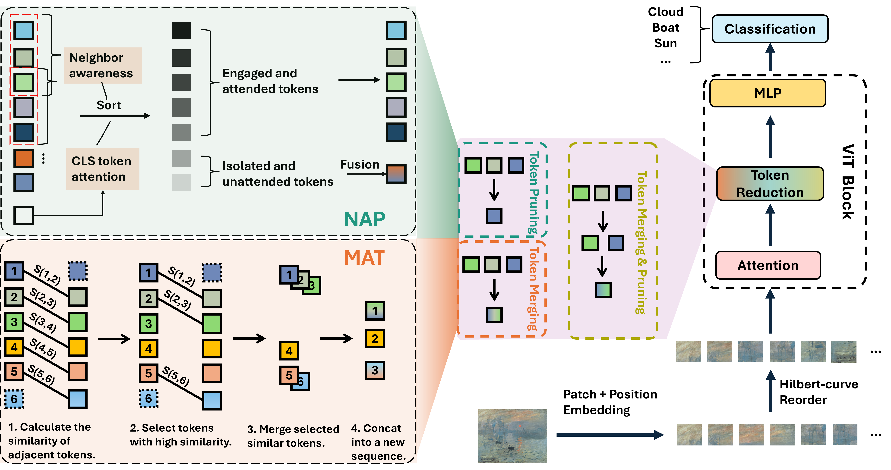

# NAP and MAT

Neighbor-Aware Token Reduction via Hilbert Curve for Vision Transformers.

The figure below shows the detailed process of our proposed NAP and MAT token reduction method, which includes two core modules: neighbor-aware pruning (NAP) and merging adjacent tokens (MAT).



The pipeline starts with an input image, goes through tokenization/patching, Hilbert-curve reordering, attention mechanism, and then efficient token reduction through NAP or MAT modules before finally being used for the classification task.

## **Evaluation**

#### NAP

NAP (Neighbor-aware Pruning) is a token pruning method. The code is inherited from **[EViT](https://github.com/youweiliang/evit)** and modified. Therefore the instructions used are the same.

e.g. To evaluate DeiT-S-16/224 on ImageNet val set. Replace `base_keep_rate` with the keeping ratio you want.

```
python3 main.py --model deit_base_patch16_shrink_base --fuse_token --base_keep_rate 0.7 --eval --resume /path/to/checkpoint --data-path /path/to/imagenet
```

The following results are without fine-tuning after applying NAP, and are evaluated on a single RTX3080 with batch_size=16.

|   Model   | Flops | Keep rate | R |  a  | Top-1 Acc | Throughput<br /> (imgs/s) |
| :--------: | :---: | :-------: | :-: | :-: | :-------: | :-----------------------: |
| DeiT-S/224 | 4.6G |    1.0    | - |  -  |   79.8   |            915            |
| DeiT-S/224 | 4.0G |    0.9    | 2 | 0.1 |   79.7   |            998            |
| DeiT-S/224 | 3.5G |    0.8    | 3 | 0.1 |   79.3   |           1100           |
| DeiT-S/224 | 3.0G |    0.7    | 4 | 0.2 |   78.6   |           1281           |
| DeiT-S/224 | 2.6G |    0.6    | 2 | 0.1 |   76.9   |           1400           |
| DeiT-S/224 | 2.3G |    0.5    | 3 | 0.1 |   74.0   |           1600           |

Try different R and a and you might get better results! 

#### HyNAP

HyNAP (Hybrid NAP) is inherited from **[DiffRate](https://github.com/OpenGVLab/DiffRate)** and modified. The instructions used are the same as DiffRate.

e.g. To evaluate DeiT-S-16/224 on ImageNet val set. Replace `target_flops` with the flops you want (refer to compression_rate.json according to different models).

```
python main.py --eval --load_compression_rate --data-path /path/to/imagenet --model deit_small_patch16_224 --target_flops 2.3
```

The following results are without fine-tuning after applying HyNAP, and evaluated on single RTX3080 with batch_size=16.

|   Model   | Flops | R |  a  | Top-1 Acc | Throughput<br />(imgs/s) |
| :--------: | :---: | :-: | :-: | :-------: | :----------------------: |
| DeiT-S/224 | 2.9G | 3 | 0.1 |   79.6   |           1085           |
| DeiT-S/224 | 2.3G | 2 | 0.2 |   78.7   |           1230           |
| DeiT-B/224 | 17.6G | - |  -  |   81.8   |           283           |
| DeiT-B/224 | 11.5G | 2 | 0.1 |   81.5   |           387           |
| DeiT-B/224 | 8.7G | 2 | 0.2 |   79.3   |           504           |

#### MAT

MAT (Merging Adjacent Tokens) is a token merging method, and the code is inherited from **[ToMe](https://github.com/facebookresearch/ToMe)** and modified. So the prerequisites and usage are the same as ToMe.

The following results are without fine-tuning after applying MAT, and evaluated on single RTX3080 with batch_size=16.

|    Model    | Flops | r | Top-1 Acc | Throughput<br />(imgs/s) |
| :---------: | :---: | :-: | :-------: | :----------------------: |
| ViT-L (MAE) | 61.6G | 0 |   85.7   |            89            |
| ViT-L (MAE) | 31.0G | 8 |   83.6   |           161           |
| ViT-H (MAE) | 34.7G | 7 |   84.5   |           150           |
| ViT-H (MAE) | 38.5G | 6 |   85.0   |           134           |
| ViT-L (MAE) | 42.3G | 5 |   85.3   |           125           |
| ViT-L (MAE) | 46.2G | 4 |   85.6   |           113           |
| ViT-L (MAE) | 50.0G | 3 |   85.7   |           104           |

For larger models, our hardware was unable to accommodate the large batch sizes. As a result, we set the batch size to 16 for a fair comparison. However, this limited the GPU usage when running smaller models by applying MAT, leading to lower-than-expected throughput. We then experimented with increasing the batch size to 256, which significantly improved the throughput for these smaller models.

## Finetune

COMING SOON......

There is no doubt that fine-tuning will lead to an increase in accuracy, which has been proven by the work of ToMe, EViT and DiffRate.

## Note

NAP and MAT are plug-and-play. Based on our current approach to these three models, they can also be easily applied to other ViT models. 

## Acknowledgement

We sincerely thank the following outstanding works for providing the foundation upon which our code is built.

* [EViT](https://github.com/youweiliang/evit) 
* [ToMe](https://github.com/facebookresearch/ToMe)
* [DiffRate](https://github.com/OpenGVLab/DiffRate)
* [Gilbertcurve](https://github.com/jakubcerveny/gilbert)
